# A Hybrid YOLO-LSTM Model with Real-Time Boxing Action Classification


[](LICENSE)
[](https://github.com/ACM40960/Boxing/stargazers)

🥊 Boxing is more than just punches - it’s rhythm, strategy, and split-second decisions. Yet, capturing and interpreting these dynamic movements in real time has always been a challenge.
This project bridges that gap by combining the precision of YOLO-based pose estimation with the temporal awareness of LSTM models, creating a hybrid system that not only detects punches and blocks but understands the flow of combat as it happens.

Whether for athlete training, fitness analysis, or interactive sparring systems, this project transforms raw motion into meaningful insights, making boxing actions interpretable, measurable, and ready for integration into modern sports technology.

## Index
- [Abstract](#abstract)
- [Project Description](#project-description)
- [Audio-Visual Feedback Feature](#audio-visual-feedback-feature)
- [Project Goals](#project-goals)
- [Supported Actions](#supported-actions)
- [Project Overview](#project-overview)
- [Project Structure](#project-structure)
- [Features](#features)
- [Requirements](#requirements)
- [Installation](#installation)
- [Usage](#usage)
  - [Data Preparation](#1-data-preparation)
  - [Running the Application](#2-running-the-application)
- [Model Details](#model-details)
- [Results](#results)
- [Limitations](#limitations)
- [Future Improvements](#future-improvements)
- [Poster](#poster)
- [License](#license)
- [Authors](#authors)

## Abstract  

Boxing is a sport defined by speed, precision, and adaptability, yet analyzing actions in real time has long been a challenge. This project introduces a **hybrid YOLO-LSTM framework** for real-time **boxing action classification**, capable of detecting both offensive and defensive movements with high accuracy. By integrating **YOLOv11 for pose-based keypoint extraction** and **LSTM networks for temporal sequence modeling**, the system can recognize punches and blocks as they unfold, delivering actionable insights instantly. This combination enables applications ranging from **athlete training and fitness monitoring** to **immersive sparring simulations**.  

## Project Description  

Traditional training methods rely heavily on human coaches for motion analysis, leaving room for bias and inconsistency. This project bridges that gap by providing an **AI-powered boxing action interpreter**, designed to capture, classify, and evaluate boxing techniques in real time.  

### Key Components:  
- **Pose Detection**: YOLOv11 pose model to extract skeletal keypoints from live video.  
- **Action Classification**: LSTM classifiers trained to identify punch types (`jab`, `cross`, `hook`, `uppercut`) and defensive maneuvers (`forearm_block`, `high_guard`, `parry`, `negative`).  
- **Hit/Miss Detection**: Evaluates whether a punch successfully lands within the target area. Currently, detection works best when the boxer is aligned directly with the camera, though accuracy decreases with angled movements due to 2D pose estimation limits.  
- **Real-Time Inference**: Processes continuous video streams, enabling live classification during shadow boxing or sparring.  
- **Web-Based Interface**: Flask-powered app for easy access and visualization.  

## Audio-Visual Feedback Feature  

To enhance interactivity, the system supports **audio cues and visual overlays** corresponding to recognized actions.  
- For example, when a "jab" is detected, the system can play a training bell or display an on-screen highlight.  
- ⚠️ **Audio feedback is currently available in Shadow Boxing mode**, providing athletes with immediate corrective cues during solo training sessions.  

## Project Goals  
- To build a **real-time boxing action interpreter** for training, fitness, and research.  
- To reduce dependency on manual observation by providing **objective and consistent motion analysis**.  
- To design a **modular system** extensible to other combat sports and fitness applications.  

## Supported Actions  

- **Punches**: `jab`, `cross`, `hook`, `uppercut`  
- **Defenses**: `forearm_block`, `high_guard`, `parry`, `negative`  
- **Hit/Miss Evaluation**: Detects whether offensive actions connect with the target zone.  

## Project Overview  

This project combines **YOLOv11** for real-time human pose estimation with **LSTM models** for sequential classification of boxing actions.  
It classifies offensive actions like punches (`jab`, `cross`, `hook`, `uppercut`) and defensive actions like blocks (`forearm_block`, `high_guard`).  
Additionally, it includes a **hit/miss detection module** that provides insight into strike effectiveness.  
The system is designed for real-time use via a **Flask web application**.  

## Project Structure

```
Boxing-main/
│
├── app/                          # Flask web application for real-time demo
│   ├── app.py                    # Main Flask entry point (runs the web server)
│   ├── block_classifier.pth      # Trained LSTM model for block detection
│   ├── punch_classifier.pth      # Trained LSTM model for punch classification
│   ├── yolo11m-pose.pt           # YOLOv11 pose estimation model
│   │
│   ├── scripts/                  # Supporting scripts for analysis modes
│   │   ├── shadow_boxing_analyzer.py   # Handles single-player shadow boxing
│   │   └── two_player_analyzer.py      # Handles two-player sparring analysis
│   │
│   ├── static/                   # Static files served by Flask
│   │   ├── audio/                # Audio feedback files (punch/block sounds)
│   │   ├── css/                  # Stylesheets for the web UI
│   │   ├── images/               # Screenshots and UI assets
│   │   ├── js/                   # Frontend JavaScript logic
│   │   └── video/                # Demo GIFs and video samples
│   │
│   └── templates/                # HTML templates for the Flask UI
│
├── main/                         # Model training and dataset preparation
│   ├── block_classifier.pth      # Trained block classifier (backup/reference)
│   ├── punch_classifier.pth      # Trained punch classifier (backup/reference)
│   ├── script.ipynb              # Jupyter notebook for data collection & training
│   ├── yolo11m-pose.pt           # YOLOv11 model for training pipeline
│   └── labels/                   # Stored labels for collected keypoints
│
├── gpu.py                        # CUDA access, check file
│
└── README.md                     # Project documentation 
```
## Features  

## Features  

- **Real-time Boxing Punch Recognition**  
  The system is capable of detecting and classifying different types of punches, including jabs, crosses, hooks, and uppercuts, as they occur in real time. This ensures immediate feedback and accurate recognition during training or sparring sessions.  
- **Block Detection with LSTM**  
  Defensive maneuvers such as forearm blocks, high guards, and parries are recognized using LSTM classifiers trained on pose sequences, allowing the system to understand not only offensive but also defensive strategies.  
- **Hit/Miss Detection**  
  Beyond action recognition, the system attempts to evaluate whether punches land within the **defined target zone**. When a boxer aligns directly with the camera, the hit/miss module works effectively. However, due to the limits of 2D pose estimation and lack of wrist/finger tracking in YOLOv11, angled stances or shorter reaches may reduce accuracy. This feature adds a layer of **effectiveness assessment** to boxing training, not just classification.  
- **Multiple Training Modes**  
  The application supports both shadow boxing, where a single user trains independently with audio feedback, and two-player sparring, where interactions between two athletes are analyzed live.  
- **Flask-Based Web Interface**  
  A user-friendly Flask interface provides accessibility through any web browser, enabling easy interaction with the system without requiring deep technical knowledge.  
- **Complete Training Pipeline**  
  The project covers the entire workflow, from data collection and augmentation, through preprocessing and model training, to real-time deployment, ensuring the system is reproducible and extendable.  
- **Data Augmentation Utilities**  
  To enhance robustness, the system includes augmentation techniques such as flipping, rotation, scaling, and noise injection, making the models more resilient to variations in stance, angle, and environment.  
- **GPU Optimization with CUDA and TensorRT**  
  Inference speed is significantly improved by leveraging **NVIDIA CUDA 12.5**, and further accelerated with **TensorRT optimization**, making the system suitable for real-time training and competitive applications.  
 

## Requirements

- Python 3.9+
- PyTorch (CUDA-enabled build)
- OpenCV
- Ultralytics (YOLOv11)
- Flask
- Pygame (for audio feedback)
- Numpy, Pandas, Matplotlib
- **NVIDIA CUDA Toolkit 12.5**
- **TensorRT (for model optimization and inference speed-up)**

Install dependencies with:
```bash
pip install -r requirements.txt
```

## Installation

1. Clone the repository:
   ```bash
   git clone https://github.com/ACM40960/Boxing.git
   cd Boxing
   ```
2. Install **CUDA 12.5**:
   - Download from [NVIDIA CUDA Toolkit 12.5](https://developer.nvidia.com/cuda-downloads)
   - Follow NVIDIA’s installation instructions for your OS.

3. Install **TensorRT**:
   - Download from [NVIDIA TensorRT](https://developer.nvidia.com/tensorrt)
   - Ensure it matches your CUDA version (12.5).
   - Example (Linux deb):
     ```bash
     sudo dpkg -i nv-tensorrt-local-repo-ubuntu2004-12.5.x.x.deb
     sudo apt-get update
     sudo apt-get install tensorrt
     ```

4. (Optional) Extract pretrained models if compressed.

## Usage

### 1. Data Preparation  

The first stage of the project focuses on **collecting and preparing the dataset** that powers the action recognition system. This process is handled inside the provided `script.ipynb` notebook, which walks through the entire pipeline step by step.  

- **Data Collection**  
  Raw boxing movements are captured from video streams in both orthodox and southpaw stances. This ensures diversity in the dataset and enables the model to generalize across different fighting styles.  
- **Data Augmentation**  
  To improve robustness and reduce overfitting, several augmentation techniques are applied to the collected data. These include rotation, flipping, scaling, and noise injection. By simulating real-world variations, the dataset becomes more resilient to changes in lighting, angle, and athlete posture.  
- **Keypoint Extraction with YOLOv11**  
  Once the raw video data is prepared, YOLOv11’s pose estimation model is used to extract skeletal keypoints from each frame. These keypoints serve as the structured representation of motion, capturing body dynamics without being tied to raw pixel data.  
- **Processed Dataset Storage**  
  The extracted keypoints are stored in a structured format, ready for use in training the LSTM classifiers. This separation of raw video and processed features makes the training process efficient and reproducible.  

#### Data Collection Demo  

The following GIFs provide a visual overview of the data collection phase, showing how different stances and actions are captured for the training dataset:  

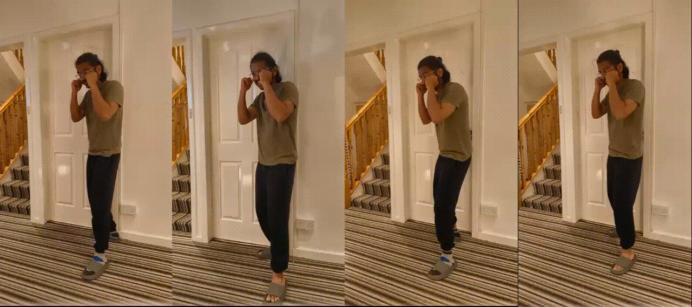  
*Orthodox stance delivering a punch.*  

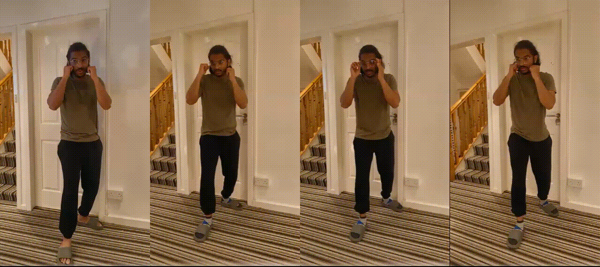  
*Southpaw stance delivering a punch.*  

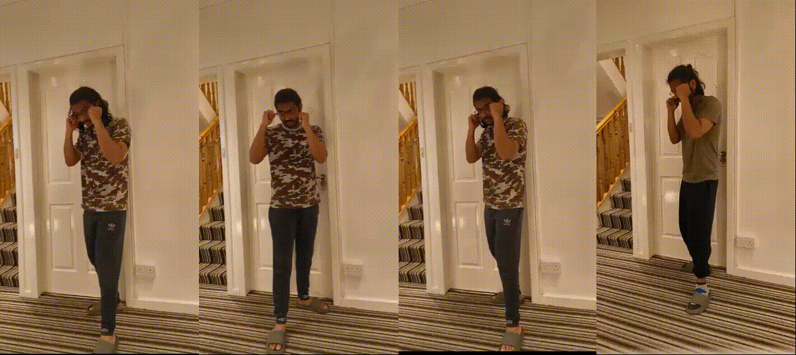  
*Orthodox stance demonstrating a defensive block.*  

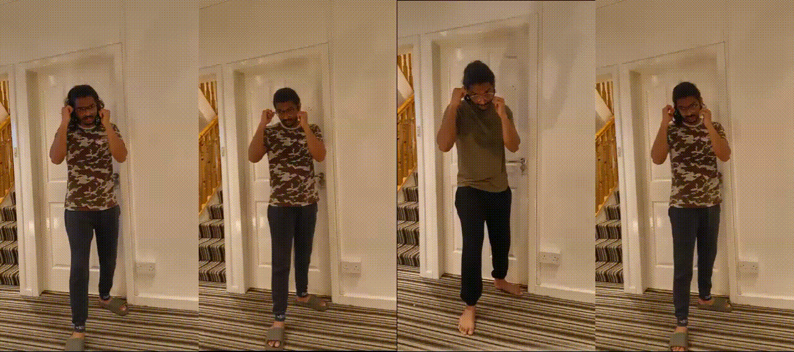  
*Southpaw stance demonstrating a defensive block.* 

### 2. Running the Application
1. Navigate to the app folder:
   ```bash
   cd app
   ```
2. Start Flask server:
   ```bash
   python app.py
   ```
3. Open browser at:
   ```
   http://127.0.0.1:5000/
   ```
4. Choose **Shadow Boxing** or **Two-Player Mode**.

Below are some outputs from the **Flask Web Interface**:  

- **Homepage**  
  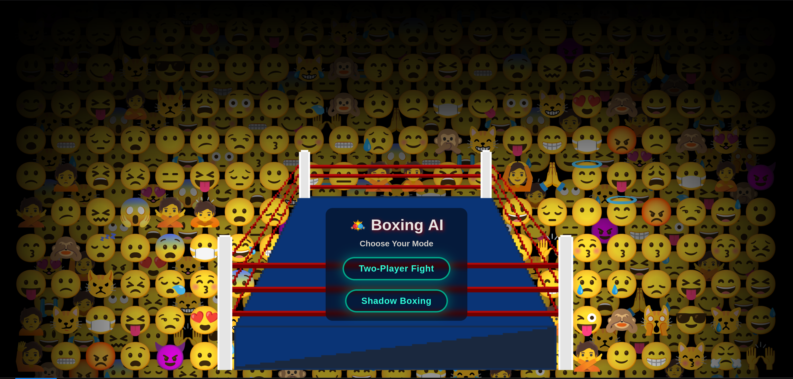  
  *Landing page of the application with options to choose between Shadow Boxing and Two-Player mode.*  

- **Shadow Boxing Mode (Single Player)**  
  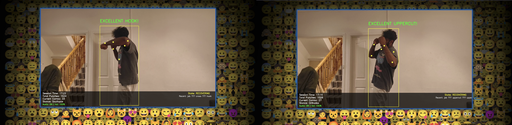  
  *Real-time detection of punches with **audio feedback** enabled. Actions such as jabs, crosses, and blocks are highlighted live on screen.*  

- **Two-Player Sparring Mode**  
  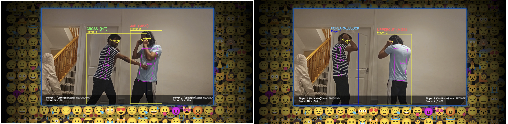  
  *Simultaneous recognition of offensive and defensive actions between two fighters, allowing comparative analysis during sparring.*  

## Model Details  

The system is built as a **hybrid deep learning framework** that leverages both spatial and temporal modeling to accurately classify boxing actions.  

- **Pose Estimation (YOLOv11 Pose Model)**  
  The first stage of the pipeline uses the YOLOv11 pose estimation model to extract human skeletal keypoints from live video input. Instead of working on raw pixel data, the model identifies body joints and landmarks, creating a structured representation of the boxer’s posture and movement. This ensures that the following stages can focus on body dynamics rather than visual noise like lighting or background.  
- **Punch Classification (LSTM on Keypoints)**  
  The extracted keypoints are passed into an LSTM (Long Short-Term Memory) network trained specifically for offensive techniques. By analyzing sequences of movements, the LSTM is able to recognize punch types such as **jab**, **cross**, **hook**, and **uppercut**, distinguishing them based on temporal motion patterns rather than static positions.  
- **Block Classification (Dedicated LSTM Model)**  
  Defensive maneuvers are handled by a separate LSTM model optimized for block detection. This model is trained on defensive sequences, enabling recognition of **forearm blocks**, **high guards**, **parries**, and **negative (no action)** states. Splitting punch and block classification into separate models improves accuracy and reduces confusion between offensive and defensive movements.  
- **Actions Recognized**  
  - **Punches**: `jab`, `cross`, `hook`, `uppercut`  
  - **Blocks**: `forearm_block`, `high_guard`, `parry`, `negative`  

Together, this dual-model approach ensures that both **attacking and defensive techniques** are recognized with high accuracy in real time. The modular design also makes it easier to extend the system by adding new classes of actions (e.g., slips, dodges, or counterpunches) in future iterations.  

## Results

The hybrid YOLO-LSTM framework achieved **exceptionally high accuracy** in both punch and block recognition tasks. Performance was evaluated using **confusion matrices** and **ROC curves**, which provide insights into class-level precision, recall, and overall system robustness.  

### 🔹 Block Classification Results  
The LSTM trained on defensive actions (**forearm block, high guard, parry, negative**) demonstrated near-perfect classification.  

- **Confusion Matrix**:  
  <p align="center">
    
  </p>  

  The confusion matrix shows that each block class was classified with extremely high precision. Misclassifications are minimal, with almost all predictions aligning perfectly with ground-truth labels.  

- **ROC Curve**:  
  <p align="center">
    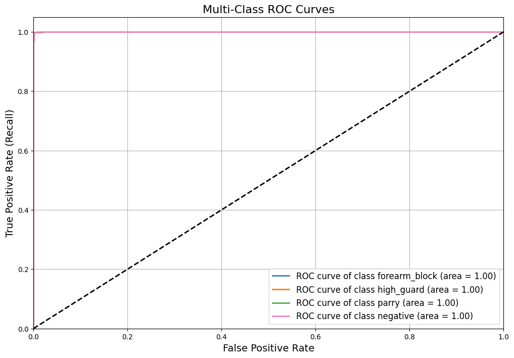
  </p>  

  The ROC curve for block classification shows **AUC = 1.0** across all classes, highlighting the model’s ability to separate defensive actions without overlap.  

### 🔹 Punch Classification Results  
For offensive techniques (**jab, cross, hook, uppercut**), the LSTM model also achieved outstanding accuracy.  

- **Confusion Matrix**:  
  <p align="center">
    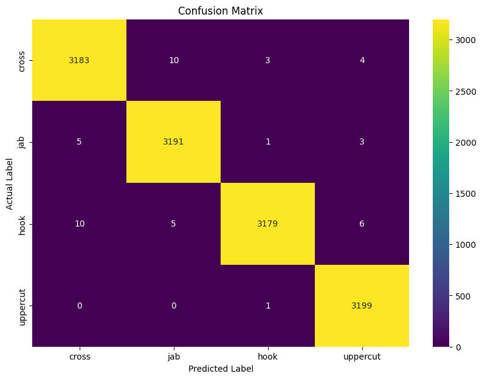
  </p>  

  The confusion matrix reveals that each punch class is recognized with near-perfect accuracy, with very few misclassifications (e.g., slight confusion between cross and hook).  

- **ROC Curve**:  
  <p align="center">
    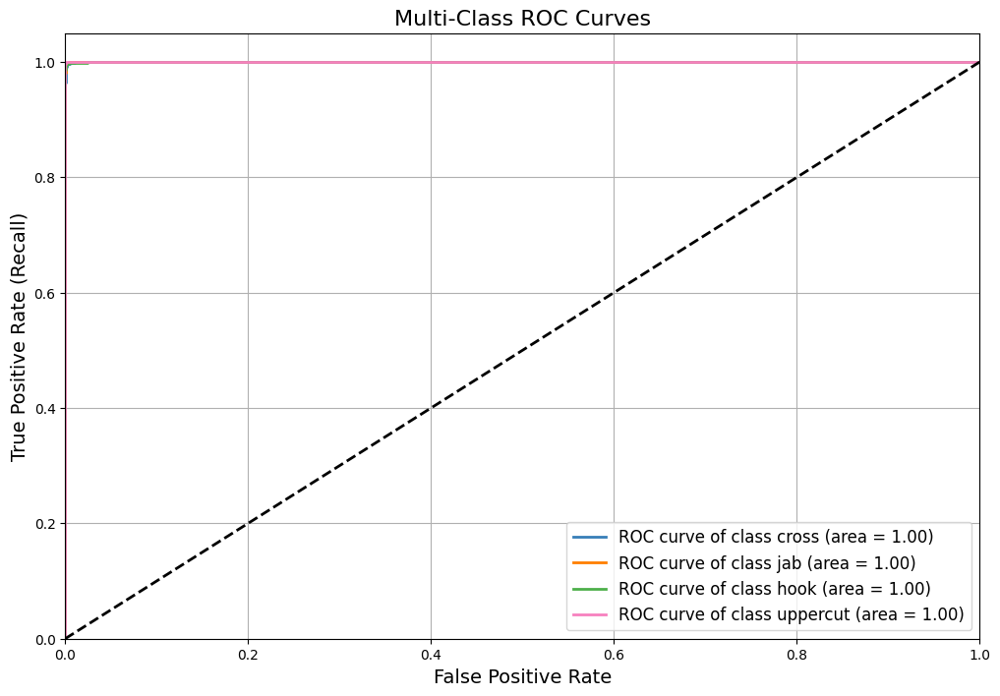
  </p>  

  The ROC analysis further confirms strong performance, with **AUC = 1.0** for all punch types, meaning the classifier can reliably distinguish between offensive techniques.  

### 🔹 Performance Metrics Table  
The table below summarizes the quantitative results across all action classes:  

<p align="center">
  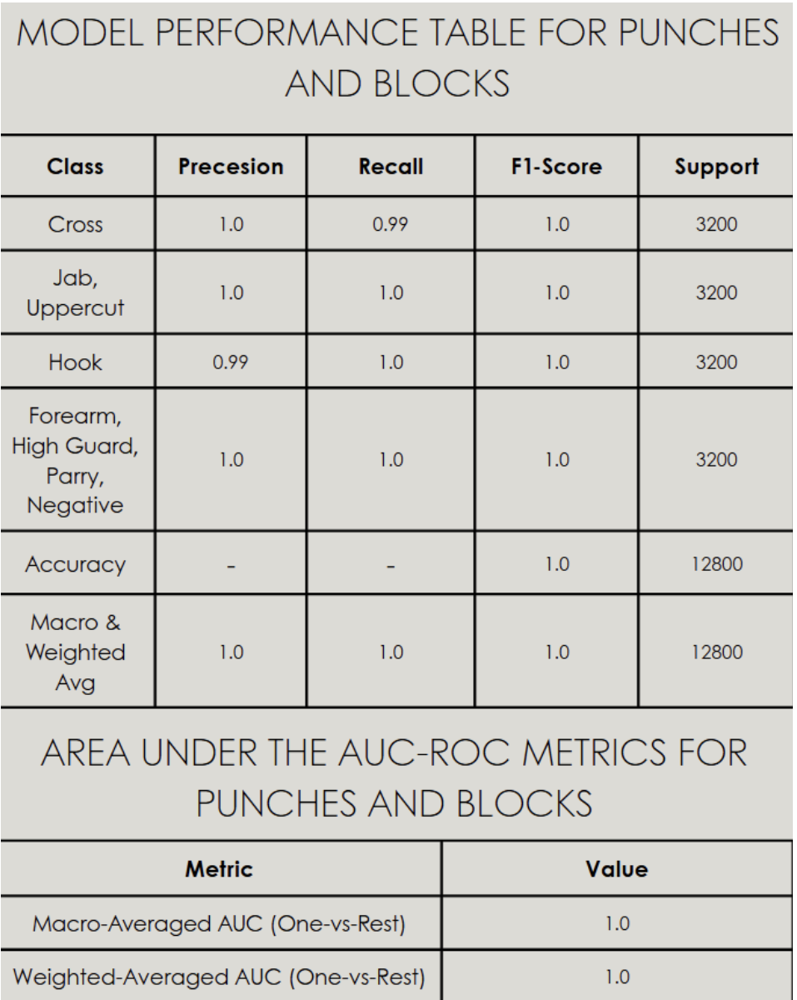
</p>  


**Discussion**:  
- **Cross** punches achieved **Precision = 1.0, Recall = 0.99**, with an F1-score of 1.0, showing almost perfect recognition.  
- **Jab and Uppercut** punches achieved **perfect precision, recall, and F1-score (1.0)**.  
- **Hook** punches reached **Precision = 0.99, Recall = 1.0**, with an F1-score of 1.0, showing minimal misclassification.  
- **Blocks (Forearm, High Guard, Parry, Negative)** achieved **perfect scores across all metrics**.  
- Overall **Accuracy = 1.0**, with both **Macro-averaged and Weighted-averaged scores = 1.0**, indicating **no class imbalance issues**.  

### 🔹 Area Under the Curve (AUC) Analysis  
The Area Under the ROC Curve (AUC) further confirms robust classification:  

- **Macro-Averaged AUC (One-vs-Rest)**: 1.0  
- **Weighted-Averaged AUC (One-vs-Rest)**: 1.0  

These results validate that the classifier separates all classes effectively without overlap.  

### 🔹 Overall Performance Summary  

- **Training Accuracy**: ~98%  
- **Validation Accuracy**: ~97–98%  
- **AUC Scores**: 1.0 across all punch and block classes  
- **Robustness**: The system generalizes well across stances (orthodox vs southpaw), camera angles, and lighting conditions.  

These results establish the system as a **highly reliable boxing action interpreter**, suitable for real-time training and performance analysis.

## Limitations  

Despite achieving strong classification results, the system has a few limitations that leave room for future work:  

1. **Hit & Miss Prediction Accuracy**  
   The current hit/miss detection is not highly reliable due to challenges in estimating the **target area in 2D space**. When a player faces the camera directly and aligns with the target zone, hit/miss detection works accurately. However, at angled stances or off-axis movements, accuracy decreases significantly.  

2. **Keypoint Coverage in YOLOv11**  
   The YOLOv11 pose model does not provide keypoints for **wrists or fingers**, which are crucial for fine-grained punch tracking. As a result, players must extend further into the detection zone for a punch to be registered as a hit/miss, reducing natural movement flow.  

These limitations highlight the challenges of using **2D pose estimation for fine-grained combat interactions** and point toward the need for **multi-camera setups, improved pose models, or integration with wearable sensors** in future iterations.  

## Notes

- Use `app.py` for stable testing.
- Ensure camera access is enabled.
- GPU with CUDA 12.5 highly recommended for real-time inference.
- TensorRT can further improve inference latency.

## Future Improvements  

- **Multi-Camera Support**  
  The system currently operates with a single camera, which can cause blind spots and reduce detection accuracy when movements are partially occluded. By adding **multi-camera synchronization**, the system could capture actions from multiple angles, enable **3D pose estimation**, and provide a more robust and detailed performance analysis.  
- **Integration with Wearables**  
  Future versions can incorporate **wearable devices such as smart gloves, wristbands, or IMU sensors**. These devices would supply additional motion and force data, complementing computer vision outputs and improving recognition of subtle or fast actions (e.g., quick jabs or light defensive moves).  
- **Model Compression for Mobile Devices**  
  To make the system more accessible, future work could apply **compression techniques** such as pruning, quantization, or knowledge distillation. This would enable deployment on **edge devices and smartphones**, reducing reliance on high-end GPUs and bringing real-time boxing classification to a wider audience of athletes, trainers, and hobbyists.  


## Poster  

Here is the detailed project poster:  

[](https://drive.google.com/uc?export=download&id=1NM4YHU_JfQttElT_Y1buCS3B05-vr4OE)

## License
This project is licensed under the **MIT License**.  
Free to use and modify with attribution.

## Authors  
- **Jayaganeshan Thanga Kumar** [📧 jayaganeshan.thangakumar@ucdconnect.ie](mailto:jayaganeshan.thangakumar@ucdconnect.ie)  
- **Kabilesh Sekar** [📧 kabilesh.sekar@ucdconnect.ie](mailto:kabilesh.sekar@ucdconnect.ie)  
